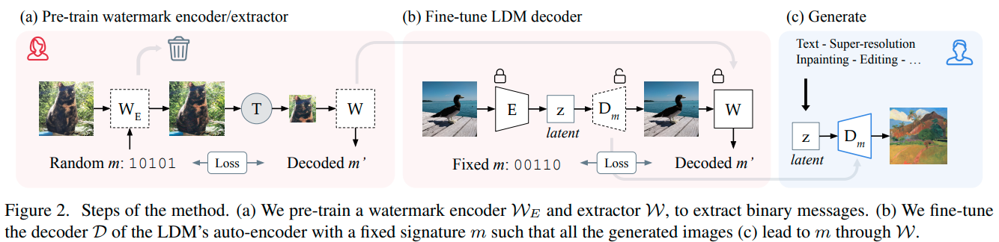

# Generate, Detect, Remove

## The Stable Signature: Rooting Watermarks in Latent Diffusion Models

Implementation and pretrained models.
For details, see [**the paper**](https://arxiv.org/abs/2303.15435) (or go to ICCV 2023 in Paris 🥐).  



[[`Webpage`](https://pierrefdz.github.io/publications/stablesignature/)]
[[`arXiv`](https://arxiv.org/abs/2303.15435)]
[[`Blog`](https://ai.meta.com/blog/stable-signature-watermarking-generative-ai/)]
[[`Demo`](https://huggingface.co/spaces/imatag/stable-signature-bzh)]


## Setup 

### Requirements
First, clone the repository locally and move inside the folder:
```cmd
git clone https://github.com/ngruixin/stable_signature
cd stable_signature
```
To install the main dependencies, we recommand using conda.
```cmd
conda env create --name envname --file=environments.yml
```
This codebase has been developed with python version 3.8, PyTorch version 1.12.0, CUDA 11.3.

### Data
The models were trained using the [COCO](https://cocodataset.org/) dataset. Download the dataset filtered for images containing people:
```cmd
python3 download_coco.py
```
This will download the data to a local directory (~/fiftyone/coco-2017/train/data). 

### Stable Diffusion 

#### Model
Download the stable diffusion model:
```cmd
mkdir sd
wget https://raw.githubusercontent.com/Stability-AI/stablediffusion/refs/heads/main/configs/stable-diffusion/v2-inference.yaml -P sd/
wget https://huggingface.co/stabilityai/stable-diffusion-2-1-base/resolve/main/v2-1_512-ema-pruned.ckpt -P sd/
```
#### Perceptual Losses

The perceptual losses are based on [this repo](https://github.com/SteffenCzolbe/PerceptualSimilarity/).
You should download the weights here: https://github.com/SteffenCzolbe/PerceptualSimilarity/tree/master/src/loss/weights, and put them in a folder called `losses` (this is used in [src/loss/loss_provider.py#L22](https://github.com/facebookresearch/stable_signature/blob/main/src/loss/loss_provider.py#L22)).
To do so you can run 
```
git clone https://github.com/SteffenCzolbe/PerceptualSimilarity.git
cp -r PerceptualSimilarity/src/loss/weights src/loss/losses/
rm -r PerceptualSimilarity
```

### Watermark Extractor Model
Download the watermark extractor model:
```cmd
mkdir models
wget https://dl.fbaipublicfiles.com/ssl_watermarking/dec_48b_whit.torchscript.pt -P models/
```

## Usage
### Watermark Generator
Use about 500 images from the COCO dataset to train watermark generators. (Repeat the step for X in \[0-20\]) 
```cmd
mkdir keys
python finetune_ldm_decoder.py --train_dir data/train --val_dir data/val --batch_size 1 --output_dir keys/keyX --seed X
```
Keys 1-10 are used to generate the train set, while keys 11-20 are used to generate the validation set.

### Watermark Classifier
The watermark classifier was trained to detect if a given image has a 48-bit watermark that was generated using Stable Signature. 
It adapts the watermark extractor model by replacing the last layer of the watermark extractor model with a fully connected layer 
of one neuron for binary classification.

Train dataset (33,000 images) consists of: 
* non-watermarked images augmented with transformations (e.g. resize, crop, etc)
* watermarked images augmented with the same transformations for 10 different keys
* non-watermarked images generated by the LDM decoder (not finetuned to produce a watermark) augmented with the same transformations
Refer to the section on "Generate Watermarked Images" in `decoding.ipynb` for the code used to generate the train/validation datasets. 

Refer to the section on "Watermark Detector" in `decoding.ipynb` for the code used for training. 
Currently, the model achieves 90.7% accuracy and an f1-score of 0.927 on the validation set of 1000 images when trained for 1 epoch.

You may download the pretrained model [here](https://drive.google.com/file/d/1rLX_MEQP6hODbEq09dVkPL_8VMdGPNf-/view?usp=sharing).

A classifier was also trained to specifically detect images generated by Meta AI. This was achieved by finetuning a 64-bit watermark 
extractor model with an additional fully connected layer to classify 2370 Meta generated images and 2400 images from Coco2017. 
Refer to `meta-classifier.ipynb` for training details. 
Currently, the model achieves 99% accuracy when testing on regular images generated by Meta and 96% on images with transformations
(random flips, crops, and color jitter) when trained on 10 epoches. 

You may download the pretrained jit model [here](https://drive.google.com/file/d/1dG-LUMb4OisV3hwweCZOp-optRjeRKZK/view?usp=sharing).

### Watermark Remover 
The watermark remover was trained to remove watermarks from a given image by finetuning the LDM decoder.
It is trained to minimize perceptual loss and classification loss of the watermark classifier (ground truth label set as non-watermarked). 

Train dataset (11,000 pairs) consists of:
* pairs of non-watermarked and watermarked images augmented with transformations

Refer to the section on "Watermark Remover" in `decoding.ipynb` for the code used for training. 
Currently, the model achieves close to 100% accuracy in removing watermarks (as determined by the watermark classifier). The images generated
after training on about 1 epoch are shown below: 
|  |
|:--:| 
| *Original image* |
|  |
| *Watermarked image* |
|  |
| *Image after watermark removal* |


You may download the pretrained model [here](https://drive.google.com/file/d/1HXDIAJjbcIbhAa3oynxQmT-F6AH6SPyw/view?usp=sharing).

## Acknowledgements

This code is based on the following repositories:

- https://github.com/Stability-AI/stablediffusion
- https://github.com/SteffenCzolbe/PerceptualSimilarity
- https://github.com/facebookresearch/stable_signature

To train the watermark encoder/extractor, you can also refer to the following repository https://github.com/ando-khachatryan/HiDDeN. 

